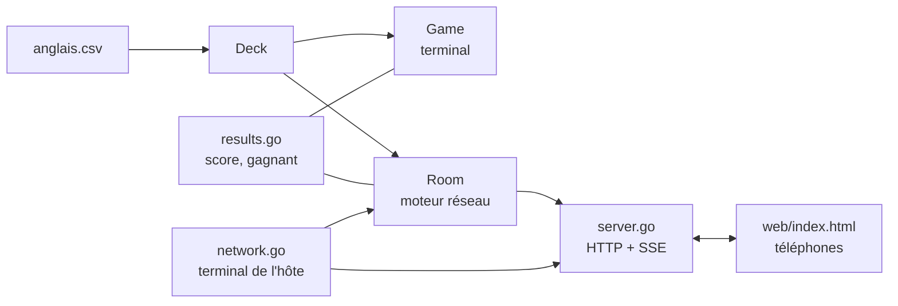
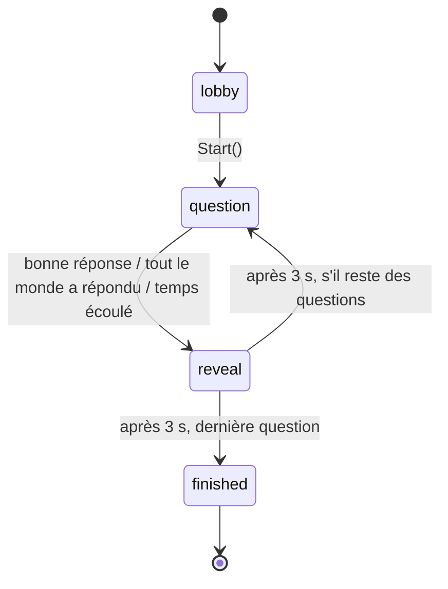

# Documentation technique

Ce document décrit le fonctionnement interne d'ask-me. Pour l'utilisation, voir le [README](../README.md).

## Vue d'ensemble

ask-me est un unique binaire Go, sans base de données ni fichier de configuration. Il a deux modes d'exécution, choisis dans [main.go](../main.go) :

- **terminal** (par défaut) : les joueurs se passent le clavier, à tour de rôle ;
- **réseau** (`-reseau`) : le binaire devient un serveur HTTP sur le réseau local, et les joueurs jouent depuis le navigateur de leur téléphone.



## Fichiers

| Fichier | Rôle |
|---|---|
| [main.go](../main.go) | options de la ligne de commande, chargement du CSV, choix du mode |
| [deck.go](../deck.go) | `Deck` : lecture et validation du CSV, tirage des questions (`RandomQuestion`, `Clue`, `Answer`) |
| [results.go](../results.go) | `Player`, score, gagnant, affichage des résultats — communs aux deux modes |
| [game.go](../game.go) | `Game` : partie dans le terminal |
| [room.go](../room.go) | `Room` : moteur de la partie en réseau (salon, modes, délais, diffusion) |
| [snapshot.go](../snapshot.go) | `Snapshot` : état de la partie envoyé aux téléphones |
| [server.go](../server.go) | serveur HTTP : page du jeu et API JSON / SSE |
| [network.go](../network.go) | côté terminal de l'hôte : choix du mode, adresse IP, invitation, QR code, résultats |
| [web/index.html](../web/index.html) | page jouée sur les téléphones (HTML, CSS et JS sans dépendance), intégrée au binaire par `embed` |

## Données : le deck

Le fichier CSV (séparateur `;`) est lu par `ParseDeck` :

- la première ligne utile donne les **thèmes** (colonnes) ;
- chaque ligne suivante est un **sujet** ; une ligne plus courte que l'en-tête est ignorée avec un log ;
- les lignes vides et les commentaires `#` sont ignorés, les espaces autour des valeurs supprimés ;
- le deck doit avoir au moins 2 thèmes et 1 sujet, sinon `ParseDeck` renvoie une erreur.

Une `Question` est un triplet d'indices `{Subject, Given, Asked}`. `RandomQuestion` tire un sujet et deux thèmes distincts sans boucle de rejet : on tire `asked` parmi `n-1` valeurs et on saute `given`.

La réponse est correcte si elle est **strictement égale** à la valeur attendue, après suppression des espaces autour de la saisie (casse et accents comptent).

## Mode terminal : `Game`

`Game.Run` enchaîne `nbTurns` tours ; à chaque tour, chaque joueur reçoit une question. Les entrées/sorties passent par des champs remplaçables (`in *bufio.Scanner`, `out io.Writer`, `rng *rand.Rand`) : un seul `Scanner` est partagé pour toute la partie, ce qui évite de perdre des lignes quand l'entrée est redirigée.

## Mode réseau : `Room`

### Machine à états



| Phase | Ce qui se passe |
|---|---|
| `lobby` | `Join(name)` ajoute un joueur et renvoie son identifiant secret |
| `question` | une question attend des réponses pendant `questionTime` (30 s) |
| `reveal` | la réponse et celui qui l'a trouvée sont affichés pendant `revealTime` (3 s) |
| `finished` | le gagnant et les résultats sont affichés ; le serveur reste ouvert pour que les téléphones les voient |

### Règles par mode

| | Chacun son tour (`ModeTurns`) | Le plus rapide (`ModeRace`) |
|---|---|---|
| Qui répond | uniquement le joueur dont c'est le tour (ordre d'arrivée) | tout le monde, une seule tentative par question |
| Nombre de questions | `n × nombre de joueurs` | `n` |
| Fin de la question | dès la réponse du joueur | première bonne réponse, ou tout le monde a répondu |
| Mauvaise réponse | échec | échec, plus de tentative sur cette question |
| Temps écoulé | échec pour le joueur dont c'est le tour | aucune pénalité |

Le gagnant est le joueur avec le plus de réussites (le premier inscrit en cas d'égalité) ; le score est le pourcentage de réussites (`results.go`).

### Concurrence et temps

- Toutes les méthodes publiques de `Room` prennent un `sync.Mutex` ; les méthodes `askQuestion`, `endQuestion` et `snapshot` supposent le verrou déjà pris.
- Les délais sont programmés par `r.schedule(d, f)` (par défaut `time.AfterFunc`). Chaque callback capture le numéro de la question (`round`) et ne fait rien si la partie a avancé entre-temps : un minuteur périmé ne peut pas terminer la question suivante.
- **Diffusion** : `Subscribe()` renvoie un canal de capacité 1 qui reçoit immédiatement l'état courant. À chaque changement, `broadcast()` vide l'éventuel état non lu puis envoie le nouveau : un abonné lent ne bloque jamais la partie et reçoit toujours l'état le plus récent.

### Ce que voient les joueurs : `Snapshot`

L'état est le même pour tous les joueurs ; chaque téléphone sait qui il est grâce au prénom renvoyé à l'inscription. Pendant une question, le snapshot ne contient **jamais** la réponse attendue (elle n'apparaît que dans `reveal`).

```json
{
  "game": "07c395c370c41458e3638879a811b897",
  "phase": "question",
  "mode": "Le plus rapide",
  "players": [
    {"name": "Léa", "successes": 1, "failures": 0, "score": 100},
    {"name": "Tom", "successes": 0, "failures": 1, "score": 0}
  ],
  "question": {
    "number": 2, "total": 5,
    "givenTheme": "la base verbale", "clue": "hold", "askedTheme": "la traduction",
    "turn": "",
    "answered": ["Tom"],
    "deadline": 1791124297266,
    "duration": 30000
  },
  "now": 1791124267851
}
```

| Champ | Description |
|---|---|
| `game` | identifiant aléatoire de la partie : le téléphone oublie son inscription s'il change |
| `turn` | en mode « chacun son tour », le joueur qui doit répondre |
| `answered` | joueurs ayant déjà répondu à la question en cours |
| `deadline`, `duration` | fin de la question (ms Unix) et durée totale, pour le compte à rebours |
| `now` | heure du serveur, pour corriger le décalage d'horloge des téléphones |
| `reveal` | `{"answer", "finder"}` pendant la phase `reveal` (`finder` vide si personne n'a trouvé) |
| `winner` | prénom du gagnant pendant la phase `finished` |

## API HTTP

Servie par `NewServer` ([server.go](../server.go)). Les messages d'erreur sont en français, car affichés tels quels aux joueurs.

| Méthode et route | Corps | Réponse |
|---|---|---|
| `GET /` | — | la page du jeu |
| `POST /api/join` | `{"name": "Léa"}` | `{"id": "<identifiant secret>"}` |
| `POST /api/answer` | `{"id": "…", "answer": "tenir"}` | `{"correct": true}` |
| `GET /api/events` | — | flux [Server-Sent Events](https://developer.mozilla.org/fr/docs/Web/API/Server-sent_events) : un `Snapshot` JSON par événement `data:` |

Codes d'erreur : `400` avec `{"error": "…"}` (corps invalide, prénom vide, trop long ou déjà pris, partie commencée, pas ton tour, déjà répondu…), `404` pour un identifiant inconnu, `405` pour une mauvaise méthode. Les corps sont limités à 4 Ko. Le flux SSE envoie un commentaire `: keep-alive` toutes les 15 s pour que les téléphones et les box ne coupent pas la connexion.

L'identifiant renvoyé par `/api/join` est un secret aléatoire de 128 bits : seul le téléphone qui s'est inscrit peut répondre pour ce joueur.

## Page des téléphones

[web/index.html](../web/index.html) est un fichier unique sans dépendance :

- l'inscription `{game, id, name}` est gardée dans `localStorage` : un joueur qui recharge la page retrouve sa place, et une ancienne inscription est ignorée si l'identifiant `game` a changé ;
- `EventSource` se reconnecte tout seul ; une bannière s'affiche quand la connexion est perdue ;
- les sections sont masquées ou affichées, sans tout redessiner, pour ne pas effacer ce que le joueur est en train de taper quand un autre répond ;
- le champ de réponse désactive majuscule automatique, correcteur et suggestions (`autocapitalize`, `autocorrect`, `spellcheck`) ;
- le texte venant du serveur est toujours inséré avec `textContent` (pas d'injection HTML via un prénom).

## Côté terminal de l'hôte

`runNetworkGame` ([network.go](../network.go)) :

1. demande le mode (`chooseMode`) ;
2. écoute sur `-port` (4242 par défaut) ;
3. trouve l'adresse locale (`lanIP`) : d'abord l'interface utilisée pour sortir vers Internet (une « connexion » UDP n'envoie aucun paquet), sinon la première adresse IPv4 privée en préférant `192.168.x.x` (les `10.x.x.x` sont souvent des VPN) ;
4. affiche le lien, le message WhatsApp et le QR code ([mdp/qrterminal](https://github.com/mdp/qrterminal)) ;
5. affiche les arrivées (`watchRoom`), lance la partie sur **Entrée**, puis affiche le gagnant et les résultats.

## Tests

```bash
go test -race ./...
```

| Fichier | Ce qui est testé |
|---|---|
| [deck_test.go](../deck_test.go) | lecture du CSV et cas d'erreur, cohérence de `anglais.csv`, tirage des questions |
| [game_test.go](../game_test.go) | partie terminal : vérification des réponses, ordre des tours |
| [results_test.go](../results_test.go) | score, gagnant, affichage des résultats |
| [room_test.go](../room_test.go) | inscription, deux modes de jeu, temps écoulé, minuteur périmé, réponse jamais divulguée, abonnements |
| [server_test.go](../server_test.go) | page, API (succès et erreurs), flux SSE de bout en bout avec `httptest` |
| [network_test.go](../network_test.go) | choix du mode, choix de l'adresse IP, invitation, suivi des arrivées |

Pour des tests rapides et déterministes :

- les générateurs aléatoires sont initialisés avec une graine fixe ;
- `Room.schedule` est remplacé par une **fausse horloge** (`fakeClock`) : `clock.elapse()` exécute les minuteurs en attente, sans attendre 30 s ;
- `echoDeck` a deux colonnes identiques, donc la bonne réponse est toujours connue (`x`).

La CI GitHub Actions ([.github/workflows/go.yml](../.github/workflows/go.yml)) compile et lance les tests avec Go 1.21 à chaque push et pull request sur `main`.

À la création d'une release GitHub, [.github/workflows/release.yaml](../.github/workflows/release.yaml) compile le binaire pour Linux, Windows et macOS (386, amd64, arm64) et publie une archive par cible avec `LICENSE`, `README.md` et `anglais.csv`, nécessaire au lancement du jeu.

## Dépendances

| Module | Usage |
|---|---|
| `github.com/fatih/color` | couleurs dans le terminal |
| `github.com/pkg/errors` | contexte sur les erreurs |
| `github.com/mdp/qrterminal/v3` | QR code dans le terminal |

Le serveur HTTP, le JSON, les SSE et l'intégration de la page utilisent uniquement la bibliothèque standard.

## Choix et limites

- **Navigateur plutôt qu'application** : rien à installer pour les joueurs, un lien suffit.
- **SSE plutôt que WebSocket** : la communication serveur → téléphones suffit (les réponses passent par un simple `POST`), et c'est disponible dans la bibliothèque standard.
- **Une partie par lancement** : pas de code de partie à saisir ; pour rejouer, relancer `./ask-me -reseau`.
- **Pas de persistance** : tout est en mémoire et disparaît à l'arrêt du programme.
- **Réseau local uniquement**, sans HTTPS ni authentification : tous les appareils doivent être sur le même Wi-Fi, et certains réseaux (invités, établissements) isolent les appareils entre eux.
- On ne peut pas quitter le salon une fois inscrit ; un joueur absent est pénalisé par le temps écoulé en mode « chacun son tour ».
